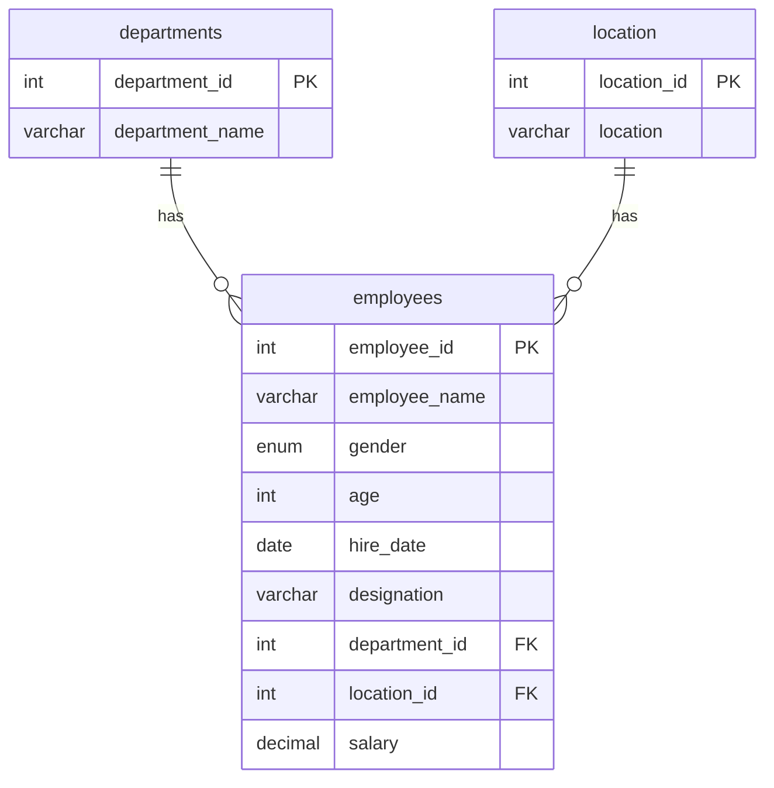

[README.md](https://github.com/user-attachments/files/33024940/README.md)
# MySQL-Assignment-1-DDL-Commands-Constraints
MySQL Assignment 1 – DDL Commands &amp; Constraints
# MySQL Assignment 1: DDL Commands & Constraints

A beginner-friendly MySQL project that builds an **Employee Database** from scratch. It covers the core DDL commands (`CREATE`, `ALTER`, `RENAME`, `TRUNCATE`, `DROP`) and the main table constraints (`PRIMARY KEY`, `FOREIGN KEY`, `UNIQUE`, `NOT NULL`, `CHECK`, `DEFAULT`, `AUTO_INCREMENT`).

## Table of Contents

- [Database Schema](#database-schema)
- [Tech Stack](#tech-stack)
- [Getting Started](#getting-started)
- [Part 1: DDL Commands](#part-1-ddl-commands)
- [Part 2: Constraints](#part-2-constraints)
- [Sample Data](#sample-data)
- [Testing the Constraints](#testing-the-constraints)
- [Concepts Covered](#concepts-covered)
- [Project Structure](#project-structure)

## Database Schema

The `employee` database has three tables. One department and one location can each be linked to many employees (one-to-many).



## Tech Stack

- **Database:** MySQL 8.0
- **Tool:** MySQL Workbench
- **Language:** SQL

> **Version note:** `CHECK` constraints are enforced from MySQL **8.0.16**, and `DEFAULT (CURRENT_DATE)` needs **8.0.13** or later.

## Getting Started

1. Install [MySQL Server](https://dev.mysql.com/downloads/mysql/) and [MySQL Workbench](https://dev.mysql.com/downloads/workbench/).
2. Clone this repository:
   ```bash
   git clone https://github.com/<your-username>/<your-repo-name>.git
   cd <your-repo-name>
   ```
3. Open `employee_db.sql` in MySQL Workbench.
4. Run the whole script with the first lightning bolt (**Execute All**), or run one statement at a time with **Ctrl+Enter**.

You can also run it from the command line:

```bash
mysql -u root -p < employee_db.sql
```

## Part 1: DDL Commands

| Command | Task | Statement |
|---|---|---|
| `CREATE` | Create the database and 3 tables | `CREATE DATABASE employee;` and `CREATE TABLE ...` |
| `ALTER` | Add an `email` column | `ALTER TABLE employees ADD COLUMN email VARCHAR(100);` |
| `ALTER` | Widen `designation` | `ALTER TABLE employees MODIFY COLUMN designation VARCHAR(200);` |
| `ALTER` | Drop `age` | `ALTER TABLE employees DROP COLUMN age;` |
| `ALTER` | Rename `hire_date` | `ALTER TABLE employees RENAME COLUMN hire_date TO date_of_joining;` |
| `RENAME` | Rename tables | `RENAME TABLE departments TO departments_info;` and `RENAME TABLE location TO locations;` |
| `TRUNCATE` | Remove all rows from `employees` | `TRUNCATE TABLE employees;` |
| `DROP` | Drop the table, then the database | `DROP TABLE employees;` then `DROP DATABASE employee;` |

## Part 2: Constraints

The database is dropped and rebuilt with all constraints applied.

### Departments

```sql
CREATE TABLE departments (
  department_id   INT AUTO_INCREMENT PRIMARY KEY,
  department_name VARCHAR(100) NOT NULL UNIQUE
);
```

### Location

```sql
CREATE TABLE location (
  location_id INT AUTO_INCREMENT PRIMARY KEY,
  location    VARCHAR(30) NOT NULL UNIQUE
);
```

### Employees

```sql
CREATE TABLE employees (
  employee_id   INT PRIMARY KEY,
  employee_name VARCHAR(50) NOT NULL,
  gender        ENUM('M','F'),
  age           INT,
  hire_date     DATE DEFAULT (CURRENT_DATE),
  designation   VARCHAR(100),
  department_id INT,
  location_id   INT,
  salary        DECIMAL(10,2),
  CONSTRAINT chk_gender  CHECK (gender IN ('M','F')),
  CONSTRAINT chk_age     CHECK (age >= 18),
  CONSTRAINT fk_emp_dept FOREIGN KEY (department_id)
    REFERENCES departments(department_id),
  CONSTRAINT fk_emp_loc  FOREIGN KEY (location_id)
    REFERENCES location(location_id)
);
```

### How each requirement is met

| Requirement | Solution |
|---|---|
| Unique department id | `PRIMARY KEY` |
| No duplicate or null department names | `NOT NULL UNIQUE` |
| Auto-generated, sequential location ids | `AUTO_INCREMENT PRIMARY KEY` |
| No null or duplicate locations | `NOT NULL UNIQUE` |
| Distinct employee id | `PRIMARY KEY` |
| Employee name always provided | `NOT NULL` |
| Gender only `M` or `F` | `ENUM('M','F')` plus `CHECK` |
| Age 18 or above | `CHECK (age >= 18)` |
| Hire date defaults to today | `DEFAULT (CURRENT_DATE)` |
| Links to departments and location | Two `FOREIGN KEY` constraints |

## Sample Data

Four rows per table. Insert the parent tables first, because the foreign keys need those ids to exist.

**departments**

| department_id | department_name |
|---|---|
| 1 | HR |
| 2 | IT |
| 3 | Finance |
| 4 | Marketing |

**location**

| location_id | location |
|---|---|
| 1 | Kochi |
| 2 | Kollam |
| 3 | Trivandrum |
| 4 | Kozhikode |

**employees**

| employee_id | employee_name | gender | age | hire_date | designation | department_id | location_id | salary |
|---|---|---|---|---|---|---|---|---|
| 1 | Anu | F | 25 | 2023-06-15 | Developer | 2 | 1 | 50000.00 |
| 2 | Ravi | M | 30 | 2022-01-10 | HR Manager | 1 | 2 | 45000.00 |
| 3 | Meera | F | 28 | 2024-03-20 | Accountant | 3 | 3 | 40000.00 |
| 4 | Sanjay | M | 35 | 2021-09-05 | Marketing Lead | 4 | 4 | 55000.00 |

To see names instead of ids, join the tables:

```sql
SELECT e.employee_id, e.employee_name, e.designation,
       d.department_name, l.location, e.salary
FROM employees e
JOIN departments d ON e.department_id = d.department_id
JOIN location l    ON e.location_id   = l.location_id;
```

## Testing the Constraints

Each statement below should fail on purpose, which proves the constraint works. They are commented out in `employee_db.sql`.

| Test | Expected error | Constraint |
|---|---|---|
| Insert an employee with age 17 | `3819` check constraint violated | `chk_age` |
| Insert an employee with `department_id = 99` | `1452` foreign key fails | `fk_emp_dept` |
| Insert a second department named `HR` | `1062` duplicate entry | `UNIQUE` |
| Insert an employee with a `NULL` name | `1048` column cannot be null | `NOT NULL` |

## Concepts Covered

- Creating, altering, renaming, truncating and dropping databases and tables
- Primary keys and `AUTO_INCREMENT`
- Foreign keys and referential integrity
- `UNIQUE`, `NOT NULL`, `CHECK` and `DEFAULT` constraints
- Table creation order: parent tables before child tables
- Dropping order: child tables before parent tables
- Difference between `DELETE`, `TRUNCATE` and `DROP`
- Basic `JOIN` across three tables

## Project Structure

```
.
├── README.md        # Project documentation
└── employee_db.sql  # Full script: DDL, constraints, sample data, tests
```

## Author

**<Your Name>**
GitHub: [@your-username](https://github.com/your-username)
